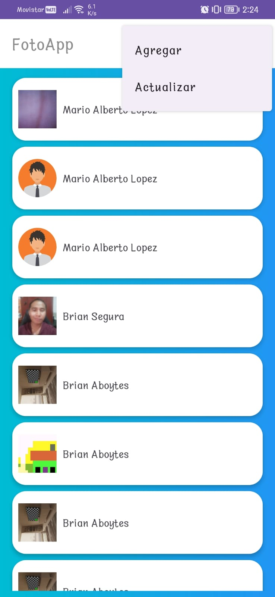
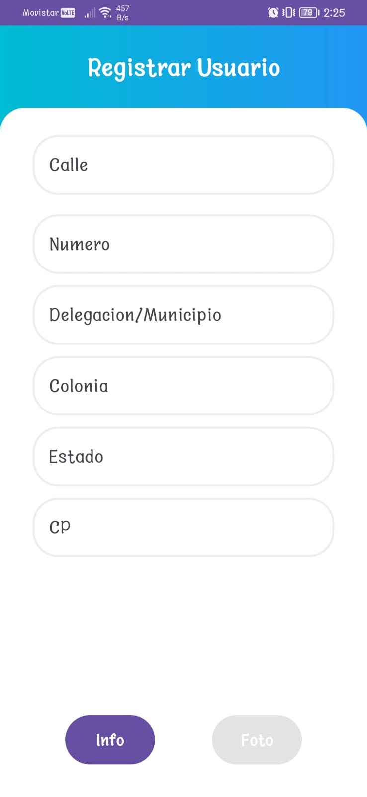
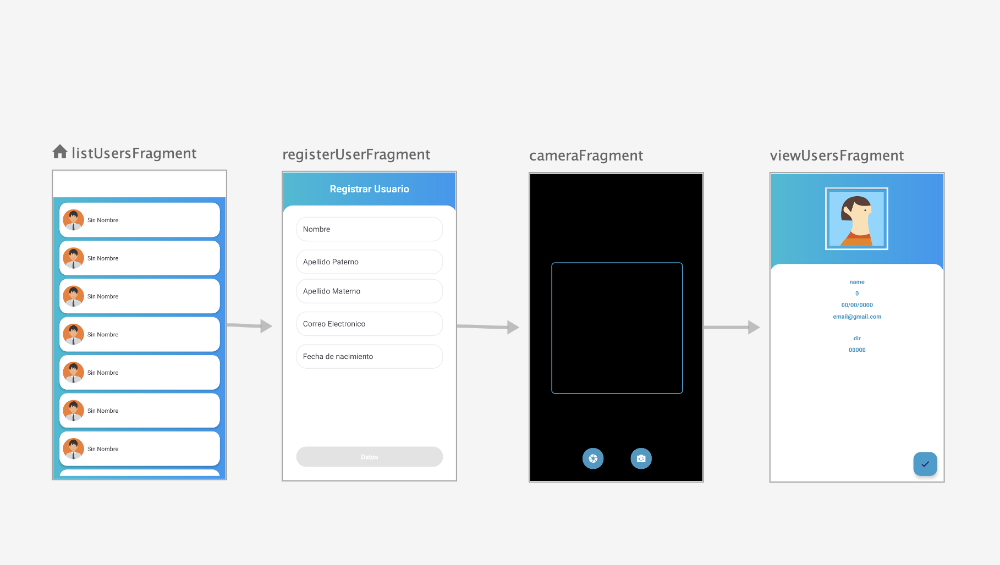

# FotoApp

FotoApp es una aplicación móvil que te permite capturar fotos, procesarlas y enviar la información junto con datos personales a través de una API. La aplicación está diseñada para demostrar el uso de tecnologías como Android, Kotlin, Retrofit, LiveData, ViewModel y más.

## Características

- Captura de fotos utilizando la cámara del dispositivo.
- Procesamiento y redimensionamiento de imágenes.
- Envío de datos personales y fotos a través de una API REST.
- Interfaz de usuario intuitiva y fácil de usar.
- Visualizacion de los datos
- 
## Capturas de Pantalla

## Tecnologías Utilizadas

- Android
- Kotlin
- Retrofit
- LiveData
- ViewModel
- Gson
- MVVM
- NavigationController

## Configuración del Proyecto

1. Clona el repositorio: `git clone git@github.com:brian9321/PrDicio.git`
2. Abre el proyecto en Android Studio.
3. Conecta tu dispositivo Android o usa un emulador.
4. Compila y ejecuta la aplicación.

## Uso

1. Abre la aplicación en tu dispositivo.
2. Visualiza Los registros
3. Oprimer el Menu y seleccion Agregar para cargar un nuevo usuario
4. Llena los campos solicitados
5. Captura una foto utilizando la cámara.
6. Visualiza tus datos y la foto en Base64 y almacenada en tu celular
7. Presiona el botón para procesar y enviar la foto y los datos.
8. Espera la respuesta de la API y verifica el estado en la interfaz de inicio.

## Créditos

Esta aplicación fue desarrollada por [Brian Aboytes Morales](https://github.com/brian9321).
